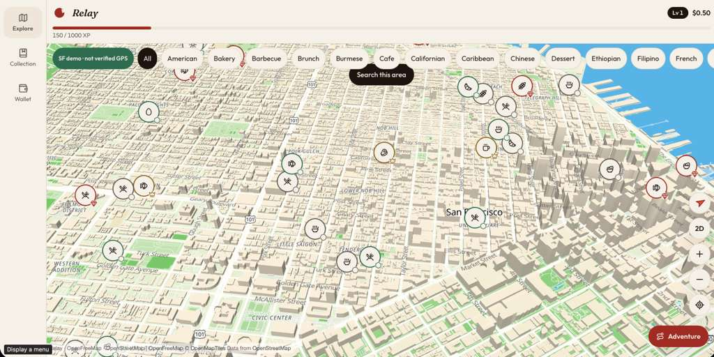
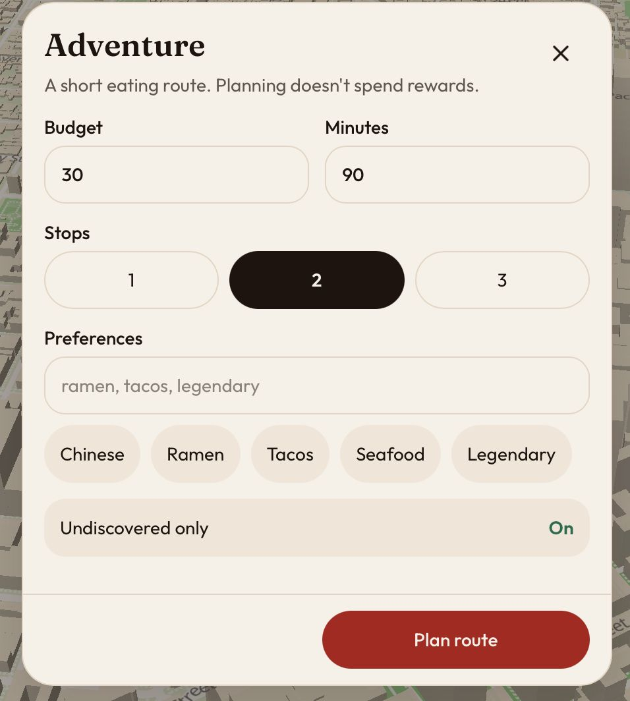
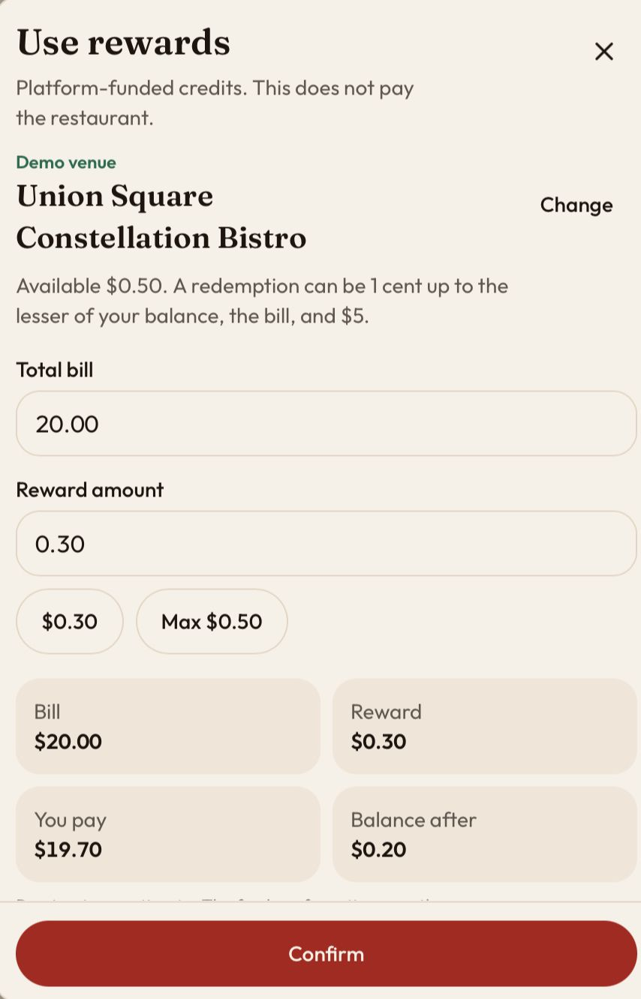
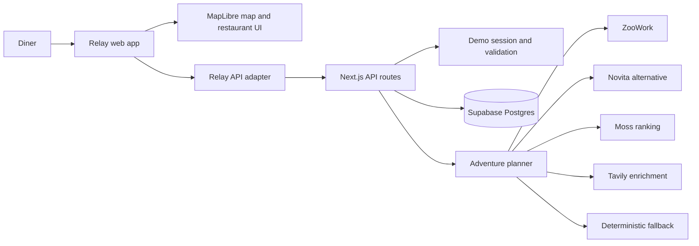

# Relay

> **Restaurant rewards that travel.**

Relay is a gamified restaurant-discovery platform that encourages people to try new places. Diners explore nearby restaurants on an interactive map, collect venues, earn XP, receive platform-funded credits, and use those credits at a different restaurant.

Traditional loyalty programs reward repeat visits to one business. Relay rewards exploration across a local restaurant network.

## Try Relay

| Resource | Link |
| --- | --- |
| Live application | [relay-delta-khaki.vercel.app](https://relay-delta-khaki.vercel.app) |
| Product presentation | [Restaurant rewards that travel on Gamma](https://gamma.app/docs/Restaurant-rewards-that-travel-qrl97vsh4uu25bv?mode=doc) |
| Product roadmap | [Current product and future expansion on Excalidraw](https://excalidraw.com/#json=87KGVRBSid35BgkJWX38U,ZZ-ReaH-Xi-_RNbJhmhruQ) |

> [!IMPORTANT]
> Relay is a hackathon prototype. Its restaurant catalog is synthetic, purchase confirmation is simulated, and reward redemption does not send money to a restaurant. The demo is designed to prove the product journey and backend correctness without making production payment claims.

## Product preview

### Explore restaurants across the city

The map is Relay's primary interface. Restaurant markers communicate cuisine, rarity, discovery status, and reward eligibility. Diners can browse categories, move around the map, search the visible area, inspect venues, and start a planned food adventure.



<p align="center">
  
  
</p>

The Adventure planner creates a bounded eating route using the diner's budget, available time, preferred cuisines, maximum number of stops, and discovery history. The redemption flow previews the bill, reward contribution, remaining personal contribution, and resulting wallet balance before confirmation.

## The problem

Restaurant discovery and restaurant loyalty usually live in separate systems:

- Discovery platforms help people find places, but restaurants often pay for impressions without knowing whether they produced a real visit.
- Loyalty programs reward repeat spending, but their value is normally locked to one restaurant or restaurant group.
- Diners have little incentive to leave familiar choices and try an independent venue they have never visited.
- New restaurants face a cold-start problem: they need customers before a loyalty program becomes useful.

Relay connects discovery and rewards in one loop. A diner earns value by trying a restaurant, but the value continues with them to the next restaurant.

## How Relay works

1. **Discover** a restaurant on the map.
2. **Visit** the venue and confirm a qualifying demo purchase.
3. **Collect** the restaurant and receive first-discovery XP.
4. **Earn** a platform-funded reward credit.
5. **Return** to Relay when deciding where to eat next.
6. **Redeem** the credit at a different restaurant.

This separation is intentional:

- **XP** represents permanent game progression. It is never spent.
- **Credits** represent financial value. They can be earned and redeemed.

Keeping the two systems separate lets Relay award generous XP for rare discoveries, neighborhood completion, and future quests without increasing its monetary liability.

## Current feature set

### Restaurant exploration

- Interactive, tilted MapLibre map centered on the San Francisco demo area
- Synthetic restaurant catalog with coordinates, cuisines, descriptions, meal estimates, and availability
- Cuisine filters and explicit **Search this area** behavior
- Restaurant markers with visual rarity and collection state
- Restaurant detail panel with estimated distance, discovery XP, and reward value
- Browser geolocation with a clearly labeled demo-location fallback
- Walking route guidance and approximate route rendering
- Responsive layouts for mobile, tablet, and desktop

### Collection and progression

- Restaurant rarities: common, rare, epic, and legendary
- First-discovery XP awards based on rarity
- Persistent level progress in live mode
- Collection view with discovery history
- Celebration experience for first discoveries and level-ups
- Reduced-motion support and accessible dismissal controls

### Portable reward wallet

- A qualifying visit awards a platform-funded credit
- Chronological earn and redemption ledger
- Balance previews before redemption
- Cross-restaurant portability requirement
- Replay-safe visit and redemption mutations
- Clear labeling of simulated settlement
- Server-authoritative balance and XP calculations

### Adventure planning

- Budget, duration, and one-to-three-stop constraints
- Free-text preferences and cuisine shortcuts
- Optional undiscovered-only filtering
- Streamed progress events while planning
- Server-validated restaurant IDs, costs, XP, rewards, distance, and walking-time estimates
- ZooWork or Novita planning when configured
- Optional Moss semantic ranking
- Optional Tavily enrichment for eligible real venues
- Deterministic fallback if an external provider is unavailable or returns invalid output

## Demo rules

The current demo uses explicit limits so the complete reward journey remains understandable and testable.

| Rule | Value |
| --- | ---: |
| Reward for a qualifying visit | $0.50 |
| Minimum qualifying bill | $5.00 |
| Maximum credits earned per SF calendar day | $2.00 |
| Maximum credit used in one redemption | $5.00 |
| Maximum visit distance | 100 meters |
| Maximum location age | 60 seconds |
| Maximum accepted location inaccuracy | 100 meters |
| XP required per level | 1,000 XP |

### Rarity and first-discovery XP

| Rarity | XP |
| --- | ---: |
| Common | 150 |
| Rare | 400 |
| Epic | 800 |
| Legendary | 1,200 |

Only the first qualifying visit to a restaurant grants discovery XP. A qualifying visit on a later day may grant another credit, subject to the daily rules, but it does not grant the first-discovery XP again.

## Architecture

Relay is split into two deployable applications:

- The root project contains the responsive React frontend.
- [`backend/`](backend/) contains the Next.js API and Supabase-backed domain logic.



### Frontend

The frontend is a React 19 and TypeScript application built with TanStack Start and Vite. It keeps remote data in TanStack Query and local interaction state in Zustand.

Key frontend technology:

- React 19
- TypeScript
- TanStack Start, Router, and Query
- Tailwind CSS
- MapLibre GL through `react-map-gl`
- Motion for transitions and discovery celebrations
- `canvas-confetti` for selected celebratory states
- Radix UI primitives
- Zustand for map, selection, overlay, and active-adventure state
- Zod at application boundaries

The UI talks to a single `RelayApi` interface. Two adapters implement it:

- **Mock adapter:** runs the product locally with synthetic venues and browser storage.
- **HTTP adapter:** communicates with the live `/api/v1` backend.

The adapter boundary lets the full UI operate before a backend is available and prevents UI components from depending directly on Supabase or sponsor SDKs.

### Backend

The backend is a separate Next.js application using Supabase Postgres for durable state and transactional mutations.

Key backend technology:

- Next.js App Router
- TypeScript and Zod
- Supabase Postgres
- PostgreSQL functions for atomic visits and redemptions
- `@zoowork-ai/sdk`
- `@moss-js/moss`
- `@tavily/core`
- Vitest and local Supabase integration tests

Money is stored as integer cents. XP is stored as an integer. The server calculates all awards, balances, eligibility, plan totals, and reward limits.

## Backend API

All backend endpoints use the `/api/v1` prefix.

| Method | Endpoint | Purpose |
| --- | --- | --- |
| `POST` | `/api/v1/session/demo` | Create or resume a 24-hour demo session |
| `GET` | `/api/v1/me` | Read XP, level, wallet balance, and demo metadata |
| `GET` | `/api/v1/restaurants/nearby` | Find catalog restaurants around a coordinate |
| `GET` | `/api/v1/collection` | Read discovered restaurants |
| `GET` | `/api/v1/wallet` | Read the authoritative balance and transaction history |
| `POST` | `/api/v1/visits` | Validate and record a qualifying simulated purchase |
| `POST` | `/api/v1/redemptions` | Debit portable credits at another restaurant |
| `POST` | `/api/v1/adventures/stream` | Stream progress and a bounded restaurant adventure plan |

Mutation endpoints require an `Idempotency-Key` header. Repeating the same normalized request with the same key returns the stored response. Reusing a key with a different request returns a conflict and does not mutate financial state.

### Streaming adventure contract

Adventure planning returns Server-Sent Events from a `POST` request. The stream reports three progress stages before one terminal event:

1. `catalog_loaded`
2. `candidates_ranked`
3. `plan_validated`
4. `complete` or `error`

The model or external provider can rank only bounded restaurant candidates supplied by the application. It cannot create restaurant IDs, change prices, award credits, debit the wallet, or write financial state. Application code validates the result and reconstructs all authoritative totals.

## Data model

| Table | Responsibility |
| --- | --- |
| `profiles` | XP and per-user mutation locking |
| `restaurants` | Server-authored venue catalog and reward rules |
| `visits` | Qualifying simulated purchases |
| `discoveries` | One first-discovery record per user and restaurant |
| `redemptions` | Simulated portable-credit debits |
| `wallet_transactions` | Immutable credit and debit ledger |
| `idempotency_records` | Request hashes and saved mutation responses |
| `demo_sessions` | Hashed session tokens and expiration |
| `rate_limit_events` | Durable request-rate records |

The wallet balance is derived from ledger entries rather than maintained as a freely editable client field.

## Sponsor and provider integrations

### ZooWork

ZooWork is the primary configurable Adventure planning provider. Relay supports either:

- ZooData System One through `ZOODATA_API_KEY`, or
- ZooWork Managed Agents through `ZOOWORK_API_KEY`.

The planner receives a bounded set of catalog candidates and returns ordered restaurant IDs with concise reasons. Provider output is treated as untrusted input and validated before it becomes a plan.

### Moss

Moss optionally ranks restaurants against natural-language preferences such as “casual ramen under $30” or “something legendary I have not discovered.” The Moss index uses Relay restaurant IDs so results can be mapped back to the authoritative catalog.

If Moss is unavailable, Relay continues with catalog-based ranking.

### Tavily

Tavily can enrich a small number of eligible real restaurants with current web context. The bundled catalog is synthetic, so those fixtures are deliberately never submitted to Tavily.

### Novita

Novita provides an alternative OpenAI-compatible planning provider. It is selected instead of ZooWork rather than called as a duplicate second model.

### Supabase

Supabase provides the PostgreSQL database, migrations, seed data, transactional functions, and test environment used by the live backend.

## Security and correctness

Although Relay is a demo, its reward state follows production-minded boundaries:

- Demo authentication uses a cryptographically random token stored as a hash.
- The raw session token is sent only through an HttpOnly, SameSite cookie.
- HTTPS sessions use secure cookies.
- Clients never submit a trusted user ID.
- Cookie-authenticated writes validate their request origin.
- Financial mutations require idempotency keys.
- Visits, discoveries, XP, ledger entries, and saved responses update atomically.
- Concurrent requests cannot intentionally double-award or overspend a balance.
- Server code calculates rewards and ignores client attempts to supply award values.
- Browser roles do not receive direct write access to financial tables.
- Logs exclude secrets, cookies, raw receipts, precise coordinates, and sensitive request bodies.
- Adventure providers cannot mutate reward or wallet state.
- Provider failures fall back to a deterministic plan without changing financial state.

## Repository structure

```text
.
├── backend/
│   ├── app/api/v1/              # Next.js API routes
│   ├── lib/server/              # Sessions, domain logic and providers
│   ├── shared/                  # Backend contracts and synthetic fixtures
│   ├── supabase/                # Migrations, functions and seed data
│   └── tests/                   # Unit and integration tests
├── docs/images/                 # README screenshots
├── public/                      # Frontend static assets and social images
├── src/
│   ├── components/              # Product UI by feature
│   ├── hooks/                   # TanStack Query hooks
│   ├── lib/client/              # Mock, HTTP and backend adapters
│   ├── lib/mock/                # Browser-only demo API
│   ├── routes/                  # Explore, Collection and Wallet routes
│   └── stores/                  # Local UI state
├── scripts/                     # Build, preview and platform tooling
└── vite.config.ts               # Frontend build and API proxy
```

## Local development

### Prerequisites

- Node.js 20 or newer
- npm
- Docker Desktop
- Supabase CLI

The frontend can run without Docker or Supabase when using mock mode. The complete live flow requires the backend and Supabase.

### Run the frontend in mock mode

```bash
npm install
npm run dev
```

Mock mode is the default when `VITE_API_MODE` is not set to `live`. It uses the same product screens and API interface, with browser-managed demo state.

### Start the backend

From the `backend` directory:

```bash
npm install
npx supabase start
npx supabase db reset
```

Copy `backend/.env.example` to `backend/.env.local`, then copy the local API URL and service-role key printed by `npx supabase status` into:

```text
SUPABASE_URL=...
SUPABASE_SERVICE_ROLE_KEY=...
APP_ORIGIN=http://localhost:8080
DEMO_MODE=true
ADVENTURE_PROVIDER=deterministic
```

Start the API:

```bash
npm run check:env
npm run dev
```

### Connect the frontend to the local backend

Set the frontend process to live API mode and point the proxy at the backend.

PowerShell:

```powershell
$env:VITE_API_MODE="live"
$env:RELAY_BACKEND_URL="http://localhost:3000"
npm run dev
```

Bash:

```bash
VITE_API_MODE=live RELAY_BACKEND_URL=http://localhost:3000 npm run dev
```

The browser continues to use same-origin `/api/v1` requests. Vite proxies those requests to the configured backend.

## Environment variables

### Frontend

| Variable | Required | Purpose |
| --- | --- | --- |
| `VITE_API_MODE` | No | Set to `live` to use the HTTP API; otherwise uses the mock adapter |
| `RELAY_BACKEND_URL` | Live mode | Backend origin used by the Vite and production proxy |

### Backend core

| Variable | Required | Purpose |
| --- | --- | --- |
| `SUPABASE_URL` | Yes | Supabase project URL |
| `SUPABASE_SERVICE_ROLE_KEY` | Yes | Server-only database credential |
| `APP_ORIGIN` | Recommended | Allowed frontend origin for cookie-authenticated writes |
| `DEMO_MODE` | Yes for demo mutations | Enables simulated visits and redemptions |
| `ADVENTURE_PROVIDER` | No | `deterministic`, `zoowork`, or `novita` |

### Optional providers

| Variable | Purpose |
| --- | --- |
| `ZOODATA_API_KEY` | ZooData System One credential |
| `ZOOWORK_API_KEY` | ZooWork Managed Agents credential |
| `ZOOWORK_MODEL` | ZooData model, defaulting to `instinct` |
| `ZOOWORK_AGENT_MODEL` | Managed Agent model selection |
| `NOVITA_API_KEY` | Novita API credential |
| `NOVITA_MODEL` | Novita model name |
| `MOSS_PROJECT_ID` | Moss project identifier |
| `MOSS_PROJECT_KEY` | Moss project credential |
| `MOSS_INDEX_NAME` | Moss restaurant index name |
| `TAVILY_API_KEY` | Tavily search and enrichment credential |

Never expose server credentials through `VITE_` or `NEXT_PUBLIC_` variables. Keep local credentials in ignored environment files and production credentials in the deployment platform's secret settings.

## Testing and verification

### Frontend

```bash
npm run typecheck
npm test
npm run build
```

### Backend

From `backend/`:

```bash
npm run typecheck
npm test
npm run build
```

Integration tests use local Supabase to verify first visits, replay behavior, receipt reuse, concurrent earnings, daily caps, concurrent redemptions, transaction rollback, location boundaries, session security, and persistence.

## Deployment

The frontend and backend deploy as separate Vercel projects.

- The frontend serves the Relay interface and proxies `/api/v1` to `RELAY_BACKEND_URL`.
- The backend hosts the Next.js API routes and connects to hosted Supabase.
- Backend secrets live only in the backend Vercel project's environment settings.
- `APP_ORIGIN` must match the deployed frontend origin.

The current public frontend is available at [relay-delta-khaki.vercel.app](https://relay-delta-khaki.vercel.app).

## Current limitations

- The bundled restaurants are synthetic demo venues.
- Visits use demo purchase evidence rather than a real receipt or payment provider.
- Redemptions debit the Relay demo wallet but do not settle money with a restaurant.
- Restaurant availability, meal cost, walking time, and routes are estimates.
- The demo does not provide merchant onboarding or a merchant dashboard.
- The project does not yet implement production accounts, real reimbursements, or fraud operations.
- Tavily enrichment intentionally skips the synthetic catalog.
- External planning services can fail or time out, so Relay labels and uses a deterministic fallback.

## Future scope

### Controlled pilot

- Persistent production accounts
- A licensed live restaurant data source
- One narrow, verified purchase workflow
- Controlled reward settlement
- Fraud monitoring and operational review
- Measurement of first-time, attributable restaurant visits

### Merchant campaigns

- Restaurant-funded boosted rewards
- First-visit offers
- Quieter-hour campaigns
- New-menu launch quests
- Merchant attribution and campaign reporting

### Restaurant discovery network

- Neighborhood exploration and completion
- Shared portable reward pools
- Social challenges and group adventures
- Expansion to additional cities
- Partner APIs for restaurant and payment platforms

The core growth decision remains simple: restaurants fund campaigns only after Relay can demonstrate incremental, attributable demand.

## Additional resources

- [Live Relay application](https://relay-delta-khaki.vercel.app)
- [Gamma product presentation](https://gamma.app/docs/Restaurant-rewards-that-travel-qrl97vsh4uu25bv?mode=doc)
- [Editable Excalidraw roadmap](https://excalidraw.com/#json=87KGVRBSid35BgkJWX38U,ZZ-ReaH-Xi-_RNbJhmhruQ)
- [Backend setup and API notes](backend/README.md)

---

**Relay — Rewards from one restaurant carry into the next.**
